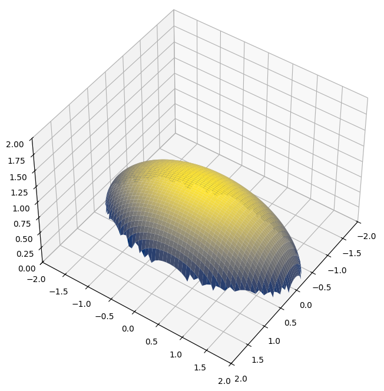

# NCKH_ML_DL

---

_**Sai Gon University, Ho Chi Minh City, VietNam**_\
**[2026–2027] Scientific Research Group**\
Group name: **SGU2607_NCKH_02**\
Professor: **Do Nhu Tai**\
Student: **Le Nguyen Anh Bao**\
Student ID: **3124411026**

---
## **Week 1**
### **Day 1:** Pytorch, Keras
- Thiết lập môi trường cho Anaconda.
- Khởi chạy JupyterLab và Visual Studio.
- Kiểm tra phiên bản của các thư viện (scipy, numpy, matplotlib, pandas, statsmodels, sklearn).
- Cài đặt các thư viện Deep Learning và kiểm tra phiên bản của các thư viện deep learning (pytorch và torchvision).
### **Day 2:** Pytorch, Keras
~ Chapter 1:
- Bối cảnh lịch sử các thư viện deep learning: từ C++ (libann, OpenNN) → Python (Caffe, Chainer, Theano) → 2 thư viện lớn hiện nay là PyTorch và TensorFlow/Keras.
- Chainer là nguồn cảm hứng cú pháp cho cả Keras lẫn PyTorch (define-by-run).
- Điểm khác biệt cốt lõi giữa PyTorch và Keras: Keras dùng model.fit(), PyTorch yêu cầu tự viết training loop.
- Cùng một kiến trúc (LeNet-5/MLP) có thể biểu diễn tương đương trên 3 framework khác nhau, chỉ khác cú pháp.
- Đã tổng hợp và chạy thử 6 đoạn code minh hoạ (Chainer MLP, PyTorch subclass, PyTorch Sequential, Keras Sequential, Keras fit, PyTorch training loop thủ công) cho cùng bài toán phân loại MNIST.

~ Chapter 2:
- PyTorch được xây trên 2 năng lực cốt lõi: tensor computation (giống NumPy, chạy được trên GPU) và automatic differentiation (autograd)
- Cài đặt qua `pip install torch` hoặc `conda install pytorch`; chạy GPU cần cài CUDA riêng.
- Ứng dụng thực tế: Computer Vision (ResNet, YOLO, Faster R-CNN), NLP (BERT, Transformer), Reinforcement Learning (DQN, PPO, A3C).
- So với TensorFlow/Keras: khác biệt nằm ở mức độ kiểm soát training loop — PyTorch viết tường minh (linh hoạt, phù hợp nghiên cứu), Keras ẩn sau `model.fit()` (nhanh, phù hợp ứng dụng chuẩn).

~ Chapter 3:
- Tensor API của PyTorch bám rất sát NumPy: tạo tensor (hằng số, `linspace`, `rand`/`randn`, `randint`, `zeros`/`full`/`ones`, `eye`), kiểm tra tensor (`shape`, `ndim`, `len`, `dtype`).
- Thao tác tensor: slicing, thêm chiều (`None`/`unsqueeze`), boolean indexing, `reshape`/`ravel`, transpose, ghép/tách (`vstack`/`concatenate`, `vsplit`/`split`).
- Các hàm trên tensor: hàm toán học theo phần tử (`exp`, `log`, `sqrt`,...), toán tử trực tiếp (`+`, `/`, `**`), `matmul`/`dot`, thống kê (`mean`, `std`, `cumsum`), `linalg.svd`, padding cho CNN (`nn.functional.pad`).
 