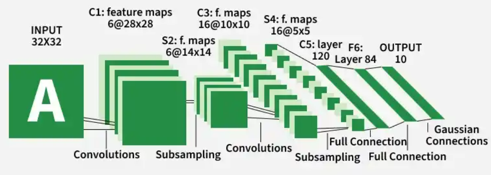
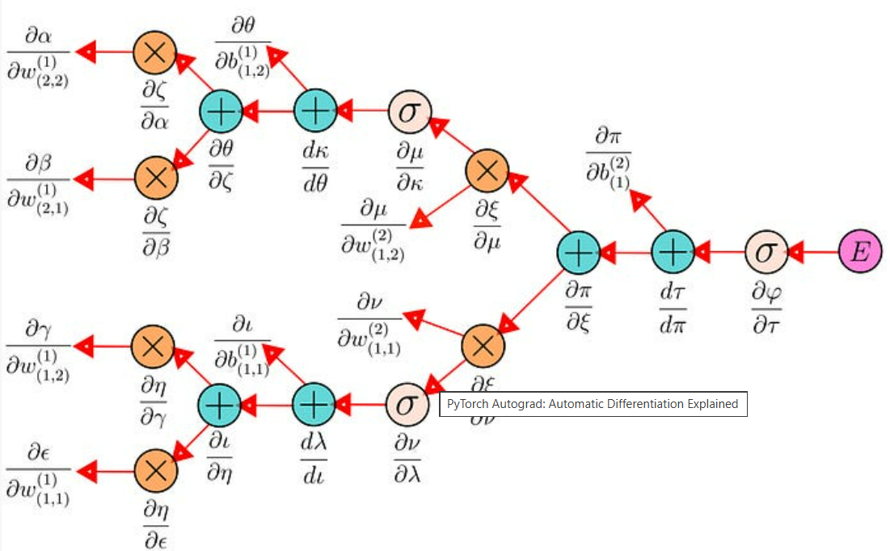
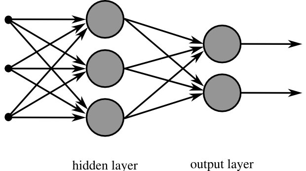
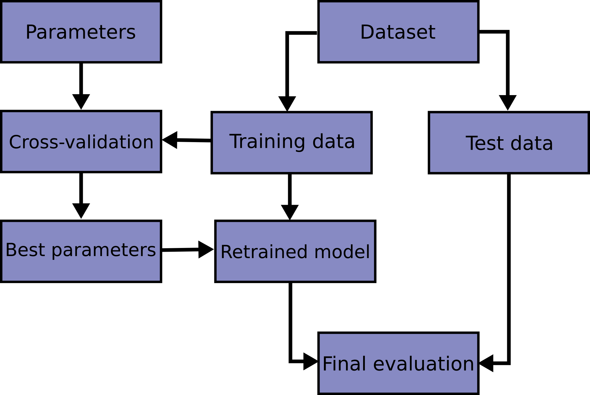

# NCKH_ML_DL

---

_**Sai Gon University, Ho Chi Minh City, VietNam**_\
**[2026–2027] Scientific Research Group**\
Group name: **SGU2607_NCKH_02**\
Professor: **Do Nhu Tai**\
Student: **Le Nguyen Anh Bao**\
Student ID: **3124411026**

---
## **Week 1**
### **Day 1:** Pytorch, Keras
- Thiết lập môi trường cho Anaconda.
- Khởi chạy JupyterLab và Visual Studio.
- Kiểm tra phiên bản của các thư viện (scipy, numpy, matplotlib, pandas, statsmodels, sklearn).
- Cài đặt các thư viện Deep Learning và kiểm tra phiên bản của các thư viện deep learning (pytorch và torchvision).
### **Day 2:** Pytorch, Keras
~ Chapter 1:
- Bối cảnh lịch sử các thư viện deep learning: từ C++ (libann, OpenNN) → Python (Caffe, Chainer, Theano) → 2 thư viện lớn hiện nay là PyTorch và TensorFlow/Keras.
- Chainer là nguồn cảm hứng cú pháp cho cả Keras lẫn PyTorch (define-by-run).
- Điểm khác biệt cốt lõi giữa PyTorch và Keras: Keras dùng model.fit(), PyTorch yêu cầu tự viết training loop.
- Cùng một kiến trúc (LeNet-5/MLP) có thể biểu diễn tương đương trên 3 framework khác nhau, chỉ khác cú pháp.
- Đã tổng hợp và chạy thử 6 đoạn code minh hoạ (Chainer MLP, PyTorch subclass, PyTorch Sequential, Keras Sequential, Keras fit, PyTorch training loop thủ công) cho cùng bài toán phân loại MNIST.

~ Chapter 2:
- PyTorch được xây trên 2 năng lực cốt lõi: tensor computation (giống NumPy, chạy được trên GPU) và automatic differentiation (autograd)
- Cài đặt qua `pip install torch` hoặc `conda install pytorch`; chạy GPU cần cài CUDA riêng.
- Ứng dụng thực tế: Computer Vision (ResNet, YOLO, Faster R-CNN), NLP (BERT, Transformer), Reinforcement Learning (DQN, PPO, A3C).
- So với TensorFlow/Keras: khác biệt nằm ở mức độ kiểm soát training loop — PyTorch viết tường minh (linh hoạt, phù hợp nghiên cứu), Keras ẩn sau `model.fit()` (nhanh, phù hợp ứng dụng chuẩn).

### **Day 3:** Pytorch, Keras

~ Chapter 3:
- Tensor API của PyTorch bám rất sát NumPy: tạo tensor (hằng số, `linspace`, `rand`/`randn`, `randint`, `zeros`/`full`/`ones`, `eye`), kiểm tra tensor (`shape`, `ndim`, `len`, `dtype`).
- Thao tác tensor: slicing, thêm chiều (`None`/`unsqueeze`), boolean indexing, `reshape`/`ravel`, transpose, ghép/tách (`vstack`/`concatenate`, `vsplit`/`split`).
- Các hàm trên tensor: hàm toán học theo phần tử (`exp`, `log`, `sqrt`,...), toán tử trực tiếp (`+`, `/`, `**`), `matmul`/`dot`, thống kê (`mean`, `std`, `cumsum`), `linalg.svd`, padding cho CNN (`nn.functional.pad`).

~ Chapter 4:
- Autograd: tensor cần `requires_grad=True` (và kiểu float) mới theo dõi được đạo hàm; gọi `.backward()` trên một scalar sẽ lan truyền ngược, kết quả nằm ở `.grad`.
- Dùng autograd để hồi quy đa thức: coi các hệ số cần tìm là một tensor `requires_grad=True`, tối ưu bằng gradient descent (`optimizer.zero_grad() → backward() → step()`) để giảm dần MSE, không cần tự đạo hàm công thức.
- Autograd tổng quát hơn deep learning: cùng cơ chế gradient descent này dùng để giải một hệ phương trình 4 ẩn (bài toán đố), không giới hạn ở huấn luyện neural network.
- Nhận ra: vòng lặp `zero_grad() → backward() → step()`.

### **Day 4:** Keras/TensorFlow (Background)

~ Chapter 2 (Introduction to TensorFlow):
- TensorFlow = thư viện tính toán số học của Google, biểu diễn dưới dạng directed graph.
- `optimizer.minimize(loss_fn, var_list=[...])` gói gọn cả tính gradient + cập nhật trọng số.
- Kết quả thật: hồi quy tuyến tính `y=0.1x+0.3` hội tụ đúng `W≈0.099, b≈0.300` sau 5000 bước.

~ Chapter 3 (Autograd bằng GradientTape):
- `GradientTape` = autograd của TensorFlow, khai báo tường minh bằng `with tf.GradientTape()`; mặc định chỉ gọi `.gradient()` được 1 lần/phép tính.
- Hồi quy đa thức hội tụ về `[1,2,3]`; bài toán đố 4 ẩn cho nghiệm `A=3.5, B=4.5, C=9.5, D=3.5`.

~ Chapter 4 (Introduction to Keras):
- Keras = lớp trừu tượng trên TensorFlow, 4 nguyên tắc: Modularity, Minimalism, Extensibility, Python-native.
- Quy trình chuẩn: `Sequential → compile → fit → predict`.

### **Day 5:** PyTorch — Part II: Multilayer Perceptron

~ Chapter 6 (MLP Building Blocks):
- 3 cách xây model bằng `nn.Sequential`: trực tiếp, `OrderedDict`, `add_module()`.
- Lưu model: toàn bộ object hoặc chỉ `state_dict()`.

~ Chapter 7 (First Neural Network — Pima Diabetes):
- Load CSV → model 8→12→8→1 (ReLU+Sigmoid) → `BCELoss`+`Adam` → train/eval.
- Accuracy ~77% qua nhiều lần chạy.

~ Chapter 8 (Training Loop):
- Thành phần chuẩn: train/test split, epoch/batch, thu thập số liệu, `tqdm` hiển thị tiến độ.

~ Chapter 9 (Evaluating Models):
- Đánh giá trên dữ liệu train là "cheating". Tách bằng `train_test_split()`.
- K-fold (`StratifiedKFold`) cho kết quả ổn định hơn — **64.05% ± 3.30%** qua 5-fold.

### **Day 6:** PyTorch — Part II: 3 Project thực hành

~ Chapter 10 (Multiclass — Iris):
- One-hot encode nhãn. `CrossEntropyLoss` gộp sẵn softmax.
- Lưu best `state_dict()` bằng `copy.deepcopy()`. Kết quả: accuracy đạt **97.8%**.

~ Chapter 11 (Binary — Sonar, Wide vs Deep):
- So sánh 2 kiến trúc cùng số tham số bằng k-fold: Wide = 75.86%±6.54%, Deep = 80.00%±9.61%.
- Quy trình chuẩn: k-fold để **chọn thiết kế**, test set riêng để **báo cáo kết quả cuối**.
- Đánh giá thêm bằng ROC curve, không chỉ 1 ngưỡng 0.5 cố định.

~ Chapter 12 (Regression — California Housing):
- Kiến trúc pyramid (8→24→12→6→1), không activation ở output. RMSE chỉnh sửa từ 0.68 → 0.54 sau `StandardScaler`.

### **Day 7:** Keras — Part II: Multilayer Perceptron (nền tảng)

~ Chapter 7 (First Neural Network — Pima Diabetes):
- `compile→fit→evaluate` chỉ 3 dòng thay vì tự viết training loop.
- Cùng cảnh báo evaluate trên train là hạn chế có chủ đích. Dự đoán sai 1/5 mẫu đầu — bằng chứng cho tính stochastic.

~ Chapter 8 (Evaluate Performance):
- 3 cách: `validation_split` tự động, `validation_data` thủ công, k-fold (**"gold standard"**).
- Kết quả k-fold: **64.68% ± 15.50%** — std rất lớn (2/10 fold tụt ~35%).

~ Chapter 9 (Multiclass — Iris):
- Kỹ thuật mới: `KerasClassifier` bọc model Keras thành estimator scikit-learn, dùng thẳng `cross_val_score()`.
- Kết quả: **97.33% ± 4.42%**.

### **Day 8:** Keras — Part II: Project thực hành & 3 cách xây model

~ Chapter 10 (Binary — Sonar):
- `sklearn.Pipeline([StandardScaler, KerasClassifier])` — tự fit scaler đúng trên từng fold, tránh leakage tốt hơn cách viết tay.
- Model nhỏ hơn (60→30→1) thắng cả baseline lẫn model lớn hơn: **86.04% ± 4.00%**.

~ Chapter 11 (Regression — Boston Housing):
- Wider (13→20→1, MSE=21.71) thắng Deeper (13→13→6→1, MSE=22.83) — sách thừa nhận khó đoán trước.

~ Chapter 12 (3 cách xây model Keras):
- **Sequential**, **Functional API** linh hoạt, làm được residual/skip connection, **Subclassing** (`__init__`+`call()`, giống PyTorch `nn.Module`).
- LeNet-5 thường trên CIFAR-10: `val_loss` tăng dần (overfitting); bản có residual block: `val_loss` ổn định hơn.
